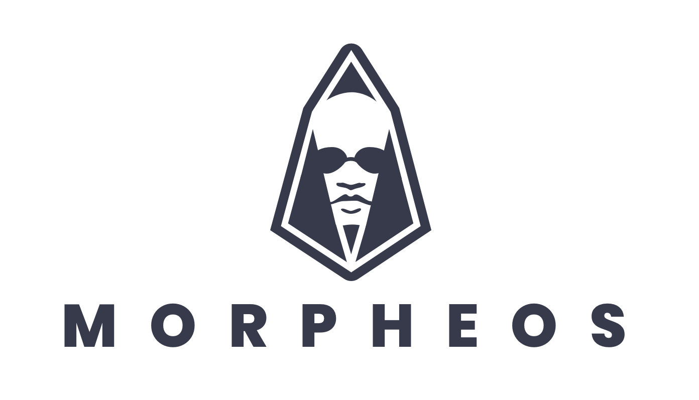

<div style="text-align: center">
  
</div>

# Morpheos

This library allows you to use any version of `eosjs` indistinctly.

## Usage

First, construct your `eosjs` instance.

Version <= 16.0.9

```js
import * as Eos from 'eosjs'

const eos = Eos({
  httpEndpoint: 'https://api.jungle.alohaeos.com',
  keyProvider: 'some-private-key',
  chainId: '038f4b0fc8ff18a4f0842a8f0564611f6e96e8535901dd45e43ac8691a1c4dca'
});
```

Version >= 20.0.0

```js
import { Api, JsonRpc } from 'eosjs'
import { JsSignatureProvider } from 'eosjs/dist/eosjs-jssig'

const signatureProvider = new JsSignatureProvider(['some-private-key']);
const rpc = new JsonRpc('https://api.jungle.alohaeos.com', { fetch });

const eos = new Api({
  rpc,
  signatureProvider,
  textEncoder: new TextEncoder(),
  textDecoder: new TextDecoder()
});
```

Then, pass it to the Morpheos constructor:

```js
import { Morpheos } from 'morpheos'

const morph = new Morpheos(eos);

async function useMorph() {
  await morph.transact([
    {
      account: 'eosio',
      name: 'buyram',
      authorization: [{ actor: 'myaccount', permission: 'active' }],
      data: { ... }
    }
  ]);

  await morph.getTableRows({
    code: 'eosio',
    scope: 'eosio',
    table: 'producers'
  }, {
    lower_bound: 'someproducer',
    limit: 10
  });

  await morph.getTableRow({
    code: 'eosio',
    scope: 'eosio',
    table: 'producers',
    primaryKey: 'someproducer'
  });
}
```
